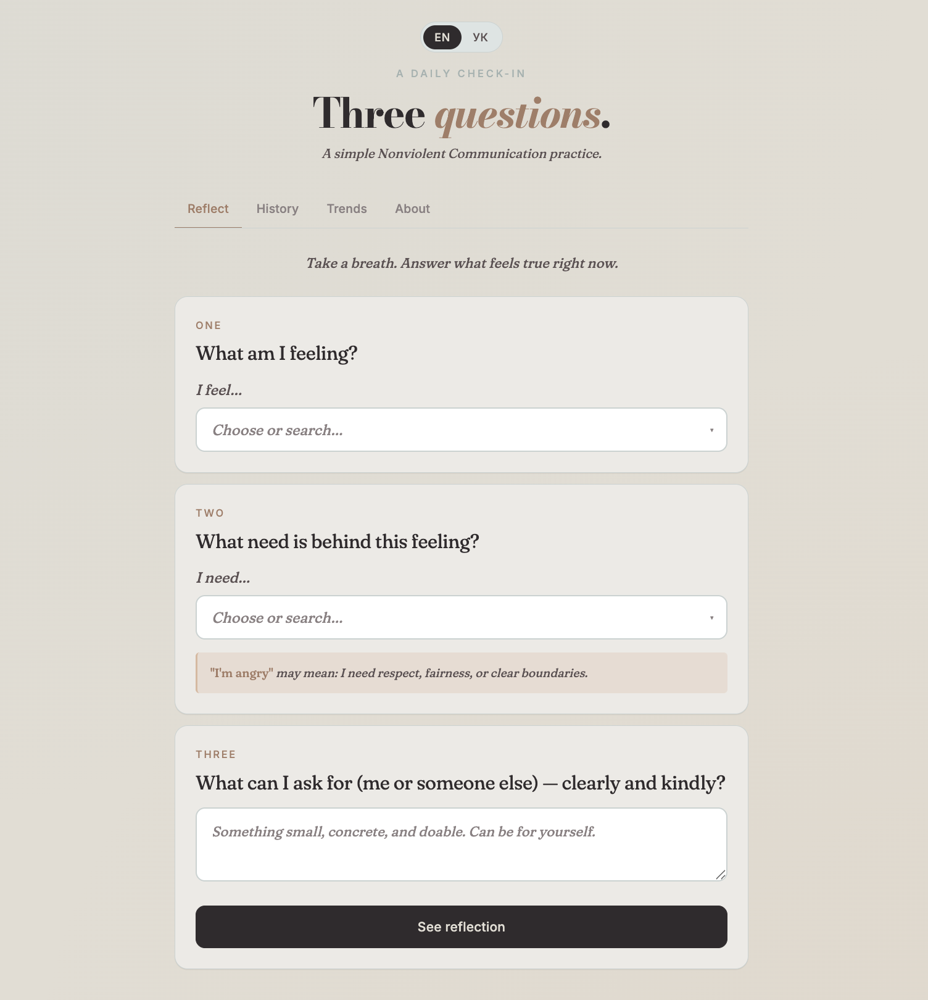

# NVC Check-In

> Three questions. A daily practice of emotional clarity.

A free, private check-in tool based on **Nonviolent Communication (NVC)**
developed by Marshall Rosenberg. No account. No server. Runs entirely in your browser.
Your data never leaves your device — and won't sync to other devices, by design.

**[→ Open the app](https://yaninatrekhleb.com/NVC_check_in/nvc-checkin.html)**

---

---

## What it does

Guides you through three NVC questions:

1. **What am I feeling?** — from the official CNVC feelings inventory
2. **What need is behind this feeling?** — connection, rest, respect, meaning…
3. **What can I ask for — clearly and kindly?** — from yourself or someone else

Your reflections are saved privately in your browser. Nothing leaves your device.

## Features

- 🔒 Fully private — data stays in your browser, nothing sent to any server
- 🌐 English and Ukrainian
- 📱 PWA — installable on your phone, works offline
- 🌿 100+ feelings and needs from the CNVC 2022 inventory
- 🔍 Searchable accordion dropdowns
- 📅 History grouped by day with streak tracking
- 📊 Trends: heatmap, top feelings, top needs
- 🎨 Watercolour design, no frameworks, single HTML file

## Tech

Vanilla HTML · CSS · JavaScript · localStorage · Service Worker

No build step. No dependencies. Open the file and it works.

## Credits

Feelings and needs vocabulary from the
[Center for Nonviolent Communication](https://www.cnvc.org) (CNVC), 2022.
NVC framework by Marshall Rosenberg.
This is an independent practice tool, not affiliated with CNVC.

## Author

Built by [Yanina Trekhleb](https://www.linkedin.com/in/yanina-trekhleb/)
· [GitHub](https://github.com/YaninaTrekhleb)
